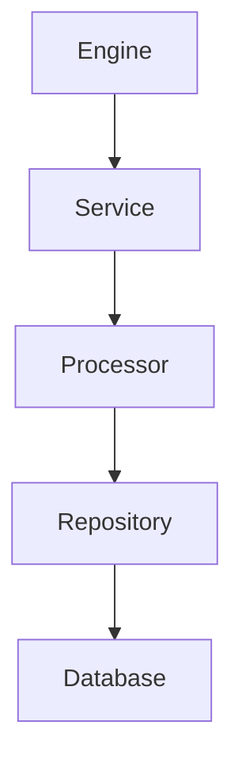
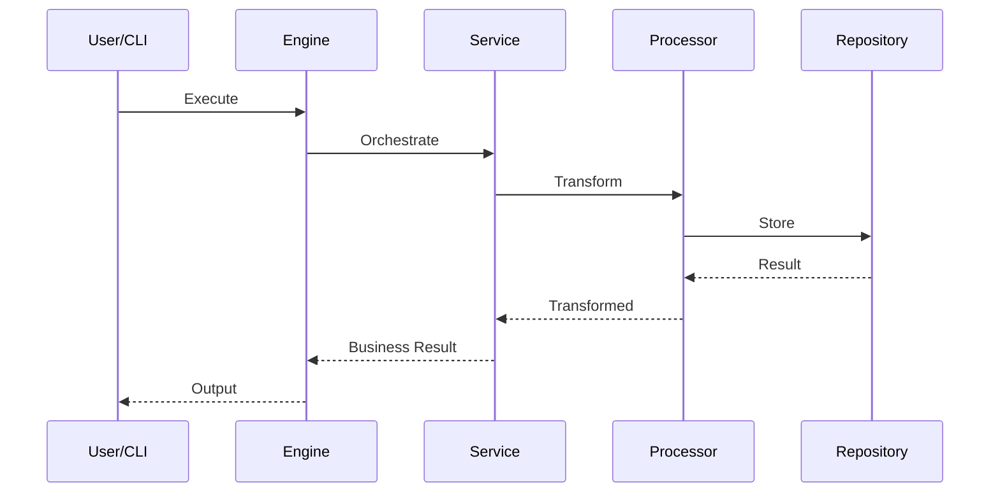
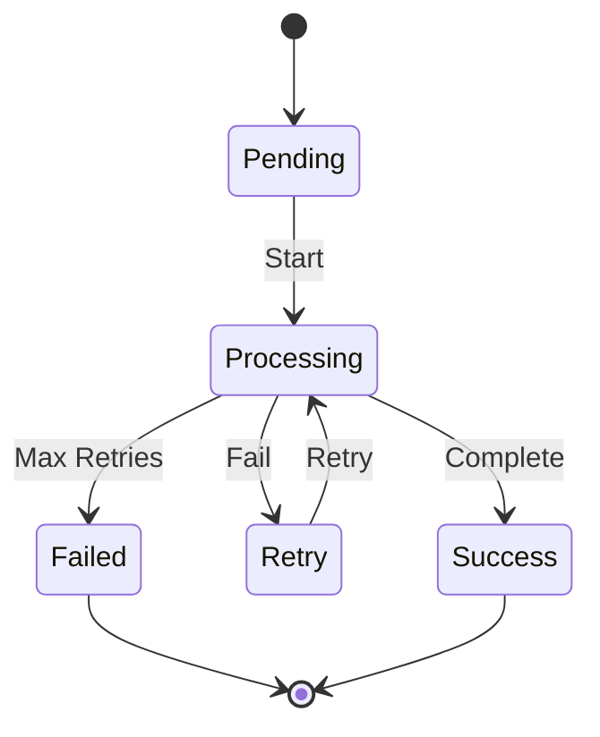

# Global Architecture & Design Rules (Practical Engineering Standard)

This document defines the global rules for designing, documenting, and evolving software architecture.

It applies to all backend systems, async systems, and scalable services.

It is NOT tied to any single project.

---

# 1. Core Philosophy

- Architecture exists to reduce complexity, not increase it.
- Design should follow real system behavior, not theoretical templates.
- Systems evolve; architecture must evolve with them.
- Start simple, scale only when needed.
- Code is the ultimate source of truth.
- Documentation is a reflection of reality, not a design authority.

---

# 2. No Forced Architecture Rule

Do NOT force patterns like:
- layered architecture
- microservices
- strict clean architecture models
- enterprise-style structure

Instead:
- Let architecture emerge from system needs.
- Identify responsibilities from actual code.
- Introduce structure only when complexity demands it.

---

# 3. Role-Based Architecture Model (NOT Layer-Based)

Architecture is defined by roles, not fixed layers.

## Core Roles

### Orchestration Role
- workflow coordination
- lifecycle management
- execution flow control

### Business Logic Role
- decision making
- validation
- core logic

### Strategy / Domain Role
- interchangeable logic
- vendor-specific behavior
- conditional execution

### Transformation Role
- parsing
- normalization
- mapping
- stateless processing

### Persistence Role
- database access only
- queries
- storage operations

### State Management Role
- lifecycle tracking
- retries
- job states
- recovery

### Async / Event Role
- queue publishing
- event triggering
- async delegation

### Execution Role
- worker processes
- Celery tasks
- background jobs

---

# 4. Minimal Architecture Principle

Not all systems need all roles.

- Small systems → functions or simple service + repository
- Medium systems → service + strategy + repository
- Large systems → full role separation + async execution

👉 Only introduce roles when complexity requires it.

---

# 5. No Premature Layering Rule

Do NOT introduce structure unless there is a real problem:

Introduce separation only when:
- duplication increases
- responsibilities become unclear
- scaling becomes difficult
- async flows become complex
- testing becomes hard

Avoid layering for:
- aesthetics
- theoretical purity
- "clean architecture" ideology

---

# 6. Code is Source of Truth Rule

- Code defines reality
- Architecture describes reality

If mismatch exists:
👉 update architecture, not code for documentation

---

# 7. Documentation Rules

Architecture documentation must:

- reflect CURRENT system state only
- stay small and readable
- avoid historical accumulation
- be updated when system behavior changes
- NOT become a changelog

---

# 8. Replace, Don't Append Rule

When architecture changes:

- update existing sections
- rewrite affected sections
- remove outdated concepts

DO NOT:
- append versions
- keep historical states

---

# 9. Technical Debt Awareness Rule

Track explicitly:

- architectural leaks
- coupling issues
- scaling bottlenecks
- async weaknesses
- temporary shortcuts

This is the ONLY section allowed to grow continuously.

---

# 10. Architectural Leak Definition

A leak is NOT missing structure.

A leak IS:
- mixing responsibilities incorrectly
- breaking role boundaries
- unintended coupling

Examples:
- DB logic inside transformation layer
- orchestration inside repository
- async logic inside business logic

---

# 11. Async System Principles

- Prefer async for heavy operations
- Workers should be stateless where possible
- Ensure idempotency
- Design retries explicitly
- Separate orchestration from execution
- Avoid blocking flows in main services

---

# 12. Scaling Principle

Scale only when needed:

1. simple system
2. async workers
3. horizontal scaling
4. queue specialization
5. distributed services
6. event-driven architecture

Do NOT skip stages.

---

# 13. Simplicity Over Structure Rule

Prefer:
- simple code
- direct flows
- minimal abstraction

Avoid:
- over-engineering
- premature microservices
- unnecessary design patterns

---

# 14. Decision Principle

Before any change ask:

- Why is this needed?
- What problem does it solve?
- What complexity does it add?
- Is there a simpler alternative?

If unclear:
👉 do not introduce change

---

# 15. Mental Model Rule

Good architecture is:

> A clear mapping of real responsibilities in the system

NOT:
- idealized design
- textbook architecture
- forced frameworks

---

# 16. DIAGRAM RULE (Mermaid System)

Diagrams are OPTIONAL but HIGH VALUE.

They must only be used when they improve understanding.

---

## 16.1 When to Use Diagrams

### REQUIRED (High value cases)
- system architecture overview
- async workflows (queues, Celery)
- execution lifecycle flows
- state transitions
- scaling evolution

---

## 16.2 When NOT to Use Diagrams

- simple functions
- CRUD operations
- obvious logic flows
- minor updates
- small refactors

---

## 16.3 Diagram Quality Rules

- must reflect REAL system, not ideal design
- must be simple and readable
- must avoid clutter
- must focus on FLOW, not structure decoration

---

## 16.4 Allowed Mermaid Types

### Flow Architecture

### Execution Flow

### State Tracking

---

## 16.5 Required Diagram Types (When Applicable)

When diagrams are used, prefer:

1. **System Overview Flow**
   - Shows: engine, service, workers, DB, queues

2. **Execution Flow Diagram**
   - Shows: request → processing → persistence → async trigger

3. **Async Task Flow**
   - Shows: queue, worker, retry, success/failure

4. **State Transition Diagram**
   - Shows: pending → processing → success/failure/retry

5. **Scaling Evolution Diagram**
   - Shows system growth stages

---

## 16.6 Diagram Rule (Most Important)

👉 A diagram must explain something faster than text.

If it does NOT:
→ DO NOT include it

---

# Final Principle

The goal of architecture is:

- clarity over complexity
- evolution over perfection
- reality over abstraction
- simplicity over formal structure
- understanding over documentation volume